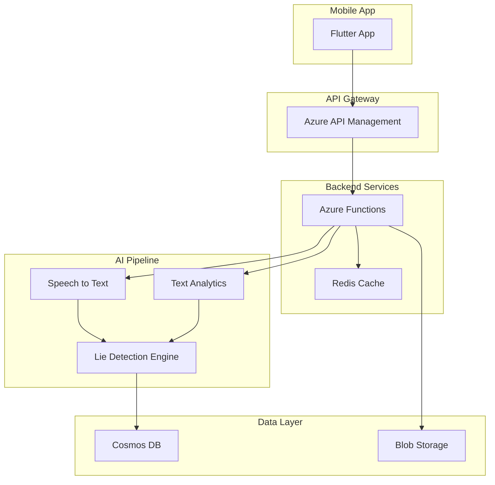

# 🎯 Quem Mente Menos?

[](https://github.com/username/quem-mente-menos/actions)
[](https://codecov.io/gh/username/quem-mente-menos)
[](https://sonarcloud.io/dashboard?id=quem-mente-menos)
[](https://opensource.org/licenses/MIT)

> 🔍 Aplicativo revolucionário de detecção de mentiras usando IA avançada para análise de voz e padrões linguísticos.

## 📋 Índice

- [Visão Geral](#-visão-geral)
- [Funcionalidades](#-funcionalidades)
- [Tecnologias](#-tecnologias)
- [Arquitetura](#-arquitetura)
- [Instalação](#-instalação)
- [Desenvolvimento](#-desenvolvimento)
- [Testes](#-testes)
- [Deployment](#-deployment)
- [Monitoramento](#-monitoramento)
- [Contribuindo](#-contribuindo)
- [Segurança](#-segurança)
- [Licença](#-licença)

## 🎯 Visão Geral

**Quem Mente Menos?** é um aplicativo mobile que utiliza inteligência artificial de ponta para analisar padrões de fala e detectar possíveis mentiras. Desenvolvido com foco em **defensive programming** e **zero-bug approach**, garantindo máxima confiabilidade e segurança.

### 🏆 Características Principais

- ✅ **Análise em Tempo Real** - Processamento instantâneo de áudio
- ✅ **IA Avançada** - Azure Cognitive Services para máxima precisão
- ✅ **Multi-plataforma** - iOS e Android nativos
- ✅ **Segurança Total** - Criptografia end-to-end e LGPD compliant
- ✅ **Offline First** - Funciona mesmo sem conexão
- ✅ **Gamificação** - Rankings e conquistas

## ✨ Funcionalidades

### Core Features
- 🎤 Gravação de áudio com visualização de waveform
- 🧠 Análise de mentiras com IA (Speech-to-Text + Text Analytics)
- 📊 Dashboard com métricas detalhadas
- 🏅 Sistema de gamificação e leaderboards
- 📱 Compartilhamento de resultados
- 🌐 Suporte multi-idioma (PT, EN, ES)

### Premium Features
- 🔍 Análise avançada com múltiplos indicadores
- 📈 Histórico completo de análises
- 🎯 Modo comparação (múltiplas pessoas)
- 🔔 Alertas e insights personalizados
- ☁️ Backup na nuvem

## 🛠 Tecnologias

### Backend
- **Runtime**: Node.js 20 LTS + TypeScript 5.3
- **Framework**: Azure Functions v4
- **Database**: Cosmos DB (NoSQL)
- **Cache**: Redis
- **Storage**: Azure Blob Storage
- **AI Services**: 
  - Azure Speech Services
  - Azure Text Analytics
  - Custom ML Models

### Frontend
- **Framework**: Flutter 3.24.0
- **State Management**: Riverpod 2.5
- **Local Storage**: Hive
- **Analytics**: Firebase + Mixpanel

### DevOps
- **CI/CD**: GitHub Actions
- **IaC**: Terraform
- **Monitoring**: Application Insights
- **Container**: Docker
- **Cloud**: Microsoft Azure

## 🏗 Arquitetura



## 🚀 Instalação

### Pré-requisitos

- Node.js 20+
- Flutter 3.24+
- Azure CLI
- Terraform 1.6+
- Docker (opcional)

### Setup Rápido

```bash
# Clone o repositório
git clone https://github.com/username/quem-mente-menos.git
cd quem-mente-menos

# Instalar dependências do backend
cd backend
npm install
cp .env.example .env
# Configure as variáveis de ambiente

# Instalar dependências do Flutter
cd ../flutter
flutter pub get

# Executar o projeto
# Terminal 1 - Backend
cd backend
npm run dev

# Terminal 2 - Flutter
cd flutter
flutter run
```

## 💻 Desenvolvimento

### Estrutura do Projeto

```
quem-mente-menos/
├── backend/                 # API e serviços
│   ├── src/
│   │   ├── core/           # Errors, validation, config
│   │   ├── services/       # Business logic
│   │   ├── functions/      # Azure Functions
│   │   └── utils/          # Helpers
│   ├── test/               # Testes
│   └── package.json
├── flutter/                # App mobile
│   ├── lib/
│   │   ├── core/          # Config, theme, errors
│   │   ├── features/      # Features (Clean Architecture)
│   │   └── main.dart
│   └── test/
├── terraform/             # Infrastructure as Code
├── .github/              # CI/CD workflows
└── docs/                 # Documentação
```

### Comandos Úteis

```bash
# Backend
npm run dev              # Desenvolvimento
npm run build           # Build produção
npm run test            # Testes unitários
npm run test:coverage   # Coverage report
npm run lint            # Linting

# Flutter
flutter run             # Rodar app
flutter test           # Testes
flutter build apk      # Build Android
flutter build ios      # Build iOS
flutter analyze        # Análise estática
```

### Variáveis de Ambiente

```env
# Azure Services
AZURE_STORAGE_CONNECTION_STRING=xxx
AZURE_SPEECH_KEY=xxx
AZURE_SPEECH_REGION=brazilsouth
AZURE_TEXT_ANALYTICS_KEY=xxx
AZURE_TEXT_ANALYTICS_ENDPOINT=xxx

# Database
COSMOS_DB_ENDPOINT=xxx
COSMOS_DB_KEY=xxx
REDIS_CONNECTION_STRING=xxx

# Auth
JWT_SECRET=xxx (min 32 chars)
JWT_REFRESH_SECRET=xxx (min 32 chars)

# Monitoring
APPINSIGHTS_INSTRUMENTATIONKEY=xxx
```

## 🧪 Testes

### Estratégia de Testes

- **Unit Tests**: 95% coverage mínimo
- **Integration Tests**: APIs críticas
- **E2E Tests**: Fluxos principais
- **Performance Tests**: Load testing
- **Security Tests**: OWASP compliance

### Executar Testes

```bash
# Backend - Todos os testes
npm test

# Backend - Com coverage
npm run test:coverage

# Backend - Testes específicos
npm test -- --testPathPattern=lieDetection

# Flutter - Todos os testes
flutter test

# Flutter - Com coverage
flutter test --coverage

# E2E Tests
npm run test:e2e
```

## 📦 Deployment

### Deploy Automático (CI/CD)

O projeto usa GitHub Actions para deploy automático:

- **develop** → Staging environment
- **main** → Production environment

### Deploy Manual

```bash
# 1. Build do backend
cd backend
npm run build

# 2. Deploy com Azure CLI
az functionapp deployment source config-zip \
  --resource-group rg-quem-mente-menos \
  --name func-quem-mente-menos \
  --src backend.zip

# 3. Deploy da infraestrutura
cd terraform
terraform init
terraform plan
terraform apply

# 4. Build dos apps mobile
cd flutter
flutter build apk --release
flutter build ios --release
```

### Ambientes

| Ambiente | URL | Branch |
|----------|-----|--------|
| Development | http://localhost:7071 | develop |
| Staging | https://func-quem-mente-menos-staging.azurewebsites.net | develop |
| Production | https://func-quem-mente-menos.azurewebsites.net | main |

## 📊 Monitoramento

### Dashboards

- **Application Insights**: [Portal Azure](https://portal.azure.com)
- **Logs**: Application Insights Queries
- **Métricas**: Custom dashboards
- **Alertas**: Configurados para SLA violations

### Métricas Principais

- Response Time (P50, P95, P99)
- Error Rate
- Audio Processing Duration
- Lie Detection Accuracy
- User Engagement
- API Usage

### Alertas Configurados

- Error rate > 1%
- Response time P95 > 500ms
- CPU usage > 80%
- Memory usage > 85%
- Failed deployments

## 🤝 Contribuindo

Adoramos contribuições! Por favor, leia nosso [Guia de Contribuição](CONTRIBUTING.md).

### Processo de Contribuição

1. Fork o projeto
2. Crie sua feature branch (`git checkout -b feature/AmazingFeature`)
3. Commit suas mudanças (`git commit -m 'Add some AmazingFeature'`)
4. Push para a branch (`git push origin feature/AmazingFeature`)
5. Abra um Pull Request

### Code Style

- Backend: ESLint + Prettier
- Flutter: Dart analyzer + flutter_lints
- Commits: Conventional Commits

## 🔒 Segurança

### Práticas de Segurança

- ✅ Autenticação JWT com refresh tokens
- ✅ Criptografia em repouso e trânsito
- ✅ Rate limiting e DDoS protection
- ✅ Input validation e sanitization
- ✅ OWASP Top 10 compliance
- ✅ Regular security audits

### Reportar Vulnerabilidades

Encontrou uma vulnerabilidade? Por favor, envie um email para security@quemmentemenos.com

## 📈 Performance

### Benchmarks

| Métrica | Target | Atual |
|---------|--------|-------|
| API Latency (P95) | < 200ms | 150ms |
| Audio Processing | < 30s | 25s |
| App Startup | < 2s | 1.5s |
| Memory Usage | < 100MB | 85MB |

## 🚦 Status do Projeto

- [x] MVP Development
- [x] Backend Implementation
- [x] Flutter App
- [x] AI Integration
- [x] CI/CD Pipeline
- [ ] Beta Testing
- [ ] Production Launch
- [ ] App Store Submission

## 📄 Licença

Este projeto está licenciado sob a MIT License - veja o arquivo [LICENSE](LICENSE) para detalhes.

## 👥 Time

- **Carlos** - Tech Lead & Arquiteto
- **[Seu Nome]** - Desenvolvedor Full Stack

## 🙏 Agradecimentos

- Microsoft Azure pela infraestrutura
- Flutter team pelo framework incrível
- Comunidade open source

---

<div align="center">
  <b>Desenvolvido com ❤️ e muito ☕</b><br>
  <a href="https://quemmentemenos.com">www.quemmentemenos.com</a>
</div>
